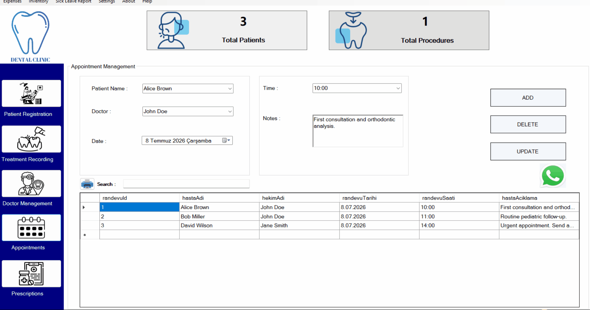
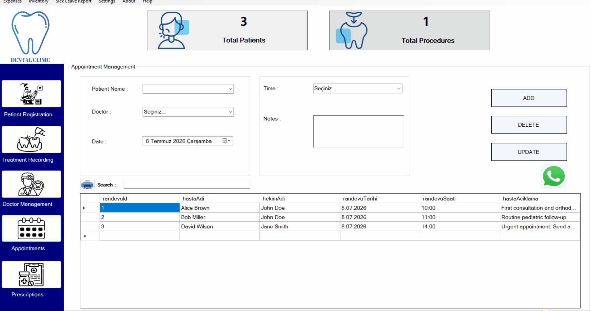
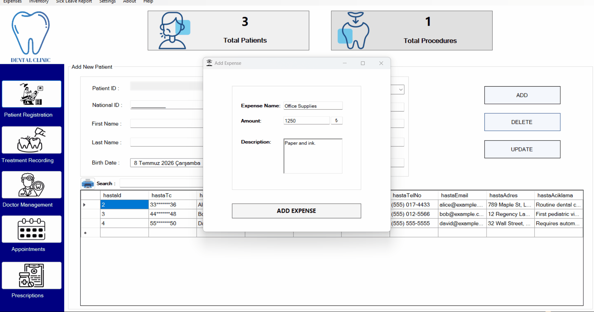
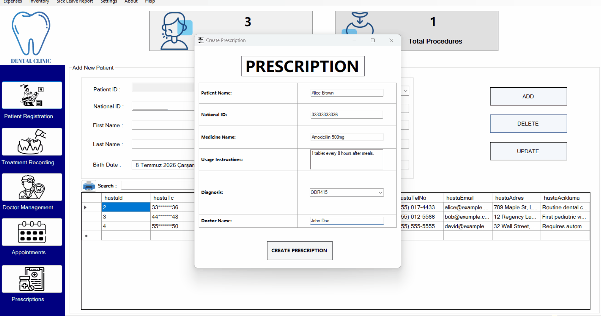
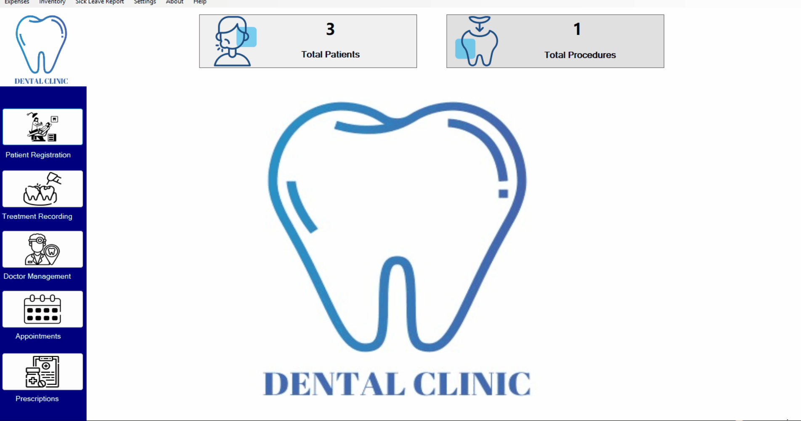
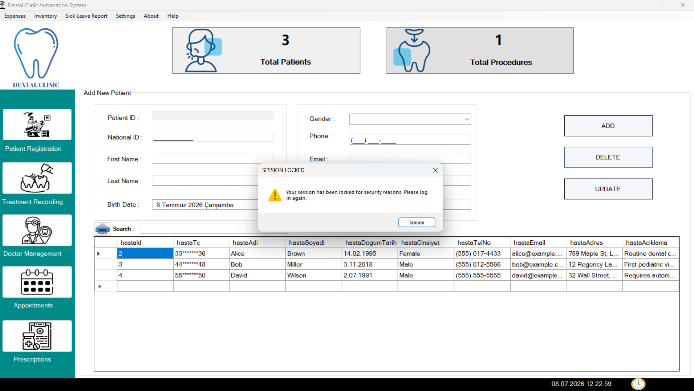

# Dental Clinic Automation & Management System

A comprehensive, desktop-based clinic management system designed for dental practices to streamline administrative workflows and ensure patient data security. Built using C# and Microsoft Access (OLEDB).

> ⚠️ **Note on Open Source Code:** This repository contains the core architectural framework of the application. High-end commercial modules (such as Live WhatsApp Integration, Financial Dashboards, and Advanced System Logs) have been omitted from the public source code to protect intellectual property. However, their full functionality is completely demonstrated in the visual walkthroughs below.

---

## 🚀 Key Features & Architectural Showcase

### 1. Core Clinic Modules (Open-Source)
* **Comprehensive CRUD Operations:** Full management of Patients, Doctors, and Treatments with a built-in **Global Search** functionality across all modules.
* **Dynamic Slot Validation:** Features an intelligent scheduling conflict-resolution engine that prevents double-booking across different doctors and time slots in real-time.
* **Soft Delete Architecture:** Implements logical deletion (`Visible = false`) to maintain relational data integrity and historical records without permanently erasing data from the database.

### 2. Premium & Commercial Modules (Demonstrated via Demos Only)
* **Automated WhatsApp Engagement:** Generates and sends personalized appointment reminders and follow-up alerts directly to patients via WhatsApp Web integration.
* **Financial Intelligence Dashboard:** Aggregates real-time clinic revenue and operational expenses to present critical cash flow insights.
* **Official Document Automation:** Instantly generates standardized prescriptions and certified medical leave documentation using a built-in **Medical Diagnosis Guide (ODR codes)**.
* **Dynamic RDLC Reporting & Export:** Integrated Report Definition Language Client-side (RDLC) to generate instantly printable lists. **Fully supports exporting all data to Microsoft Excel** for external accounting and analysis.
* **Database Operations & Security:** Supports one-click hot backups, bulk-deletion with dynamic dashboard counter resets, and UI theme switching. 
* **Automated Inactivity Lock:** Enhances security by automatically locking the active session after 5 minutes of system idle time.

---

## 🎥 Visual Walkthrough & Demos (Full Commercial Version)

### 📱 1. WhatsApp Reminders & Conflict-Free Scheduling

### 📊 2. Financial Dashboard & Analytics

### 📝 3. Prescription & Sick Leave Generation

### ⚙️ 4. Database Management & UI Theme Customization

### 🔒 5. Session Security Lock

---

## 🛠️ Technology Stack

* **Frontend:** Windows Forms (C# / .NET Framework)
* **Backend:** C# Object-Oriented Programming (OOP)
* **Database:** Microsoft Access via OLEDB Database Provider
* **Reporting:** Microsoft RDLC (Print & Excel Export Supported)
* **Architectural Concepts:** Soft Delete Logic, Real-time Data Binding, Event-Driven UI, Session Timeout Management
